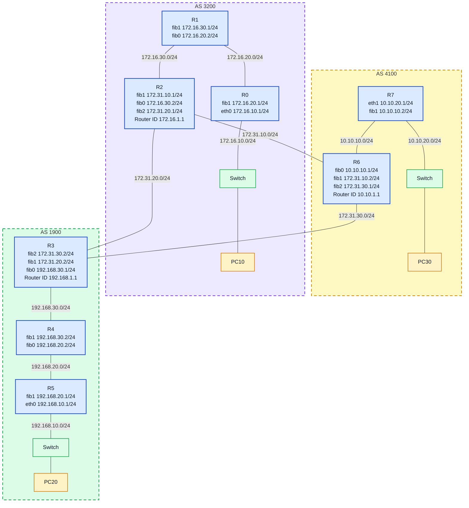

```mermaid
flowchart TB
    %% =========================
    %% AS 4100
    %% =========================
    subgraph AS4100["AS 4100"]
        direction TB
        R7["R7<br/>eth1 10.10.20.1/24<br/>fib1 10.10.10.2/24"]
        SW30["Switch"]
        PC30["PC30"]
        R6["R6<br/>fib0 10.10.10.1/24<br/>fib1 172.31.10.2/24<br/>fib2 172.31.30.1/24<br/>Router ID 10.10.1.1"]

        R7 ---|"10.10.20.0/24"| SW30
        SW30 --- PC30
        R7 ---|"10.10.10.0/24"| R6
    end

    %% =========================
    %% AS 3200
    %% =========================
    subgraph AS3200["AS 3200"]
        direction TB
        R1["R1<br/>fib1 172.16.30.1/24<br/>fib0 172.16.20.2/24"]
        R2["R2<br/>fib1 172.31.10.1/24<br/>fib0 172.16.30.2/24<br/>fib2 172.31.20.1/24<br/>Router ID 172.16.1.1"]
        R0["R0<br/>fib1 172.16.20.1/24<br/>eth0 172.16.10.1/24"]
        SW10["Switch"]
        PC10["PC10"]

        R1 ---|"172.16.30.0/24"| R2
        R1 ---|"172.16.20.0/24"| R0
        R0 ---|"172.16.10.0/24"| SW10
        SW10 --- PC10
    end

    %% =========================
    %% AS 1900
    %% =========================
    subgraph AS1900["AS 1900"]
        direction TB
        R4["R4<br/>fib1 192.168.30.2/24<br/>fib0 192.168.20.2/24"]
        R3["R3<br/>fib2 172.31.30.2/24<br/>fib1 172.31.20.2/24<br/>fib0 192.168.30.1/24<br/>Router ID 192.168.1.1"]
        R5["R5<br/>fib1 192.168.20.1/24<br/>eth0 192.168.10.1/24"]
        SW20["Switch"]
        PC20["PC20"]

        R3 ---|"192.168.30.0/24"| R4
        R4 ---|"192.168.20.0/24"| R5
        R5 ---|"192.168.10.0/24"| SW20
        SW20 --- PC20
    end

    %% =========================
    %% Enlaces entre AS
    %% =========================
    R2 ---|"172.31.10.0/24"| R6
    R2 ---|"172.31.20.0/24"| R3
    R6 ---|"172.31.30.0/24"| R3

    %% =========================
    %% Estilo
    %% =========================
    classDef router fill:#dbeafe,stroke:#1d4ed8,color:#111827,stroke-width:2px;
    classDef switch fill:#dcfce7,stroke:#16a34a,color:#111827,stroke-width:1.5px;
    classDef host fill:#fef3c7,stroke:#d97706,color:#111827,stroke-width:1.5px;

    class R0,R1,R2,R3,R4,R5,R6,R7 router;
    class SW10,SW20,SW30 switch;
    class PC10,PC20,PC30 host;

    style AS3200 fill:#ede9fe,stroke:#7c3aed,stroke-width:2px,stroke-dasharray: 8 6
    style AS4100 fill:#fef9c3,stroke:#ca8a04,stroke-width:2px,stroke-dasharray: 8 6
    style AS1900 fill:#dcfce7,stroke:#16a34a,stroke-width:2px,stroke-dasharray: 8 6

```

